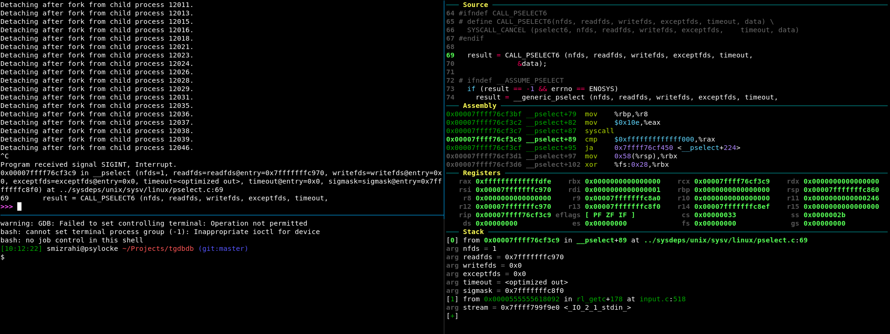

# tgdbdb - tmux + gdb + dashboard
This is a small script to get all of the above working together.

*Note that this is a work in progress.*

# Install
1. install tmux
2. install gdb
4. install [gdb-dashboard](https://github.com/cyrus-and/gdb-dashboard/issues)
5. copy `tgdbinit` to `~/.tgdbinit`
6. add to `tgdb` to `PATH`

# Use
To use just run `tgdb` instead of `gdb` when debugging.

# Features
* Sets up a pane for the dashboard and the inferior
* Aliases `db=dashboard`
* Better highlighting for dark terminals

